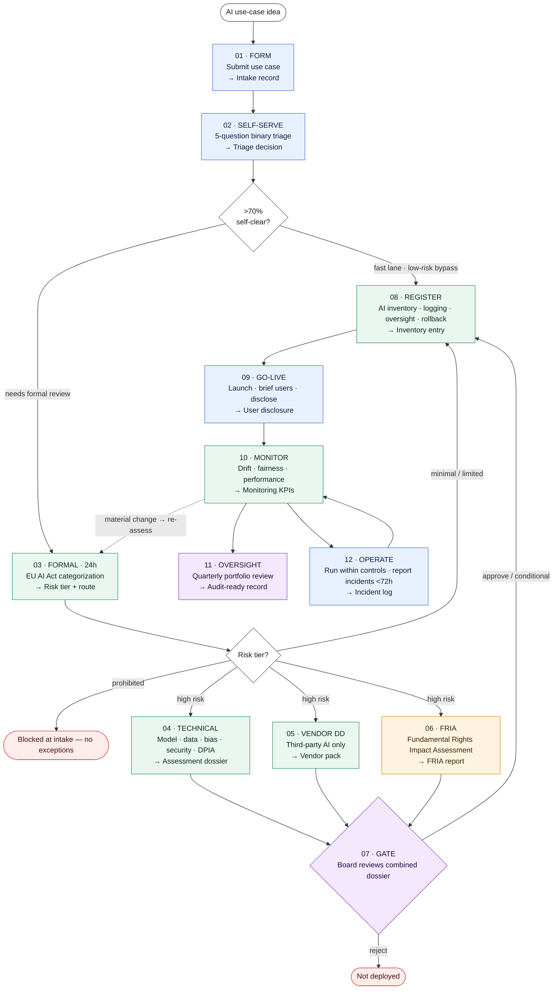

# AI Governance Workflow (EU AI Act Aligned)

## Overview

This repository defines an end-to-end AI governance workflow aligned with the **EU AI Act**, covering:

- Risk-based classification of AI systems  
- Structured risk assessment (triage + detailed evaluation)  
- Conformity assessment for high-risk AI systems  
- Regulatory compliance obligations and reporting  

The model establishes a **clear separation of responsibilities** across three core entities:

- 🔵 **Business Units** – Execution and risk ownership  
- 🟢 **AI Centre of Excellence (AI CoE)** – Governance, validation, and approval  
- 🟠 **AI Ethics & Compliance Committee** – Legal oversight and regulatory assurance  
- 🔴 **EU AI Act Obligations** – External compliance and reporting  

---

# EU AI Act — Governance Operating Model

A two-stage triage model for moving an AI use case from idea to production — safely, and at speed.

> **v2.0** &nbsp;·&nbsp; Owner: AI CoE — Governance &nbsp;·&nbsp; Scope: all AI/ML use cases, EU operations
> **SLA:** Fast lane ≤ 5 days &nbsp;·&nbsp; Full review ≤ 20 days &nbsp;·&nbsp; Reviewed quarterly by the Risk &amp; Audit Committee
> **Anchor:** Regulation (EU) 2024/1689 (EU AI Act)

## What this is

This repository documents an operating model for governing AI under the EU AI Act. Its design goal is to keep governance proportionate: the majority of use cases carry little regulatory risk and should not be slowed by a process built for the minority that do. The model therefore runs a lightweight self-service triage at intake, reserves formal categorization and assessment for cases that need it, and routes only high-risk systems to a single board-level approval gate. Technical, vendor and fundamental-rights reviews run in parallel rather than as sequential handoffs, and the monitoring stage feeds the same record created at intake so that any system is audit-ready by default.

The detailed process — phases, steps, owners, decision logic and regulatory mapping — lives in [`operating-model/`](operating-model/README.md).

## The model at a glance



**Lane colours** — blue: Business Unit · green: AI CoE · amber: Legal &amp; Compliance · purple: AI Risk Governance Board.

## Risk classification (EU AI Act, Art. 5–6)

| Tier | Examples | Obligation |
|---|---|---|
| **Minimal** | Spam filters, internal productivity tools | Voluntary code of conduct only |
| **Limited** | Chatbots, generative content | Transparency &amp; disclosure obligations |
| **High** | HR, credit, critical infrastructure | Full conformity assessment &amp; FRIA |
| **Prohibited** | Social scoring, manipulation | Blocked at intake — no exceptions |

## Repository structure

```
.
├── README.md                  ← you are here: model overview + diagram
└── operating-model/
    ├── README.md              ← detailed process: phases, steps, owners, routing, regulatory mapping
    └── workflow.mmd           ← canonical Mermaid source for the workflow diagram
```

## Source

Operating model: *EU AI Act — Governance Operating Model v2.0* (AI Risk Assessment Model).
Regulatory basis: Regulation (EU) 2024/1689 — <https://eur-lex.europa.eu>.

## Workflow Diagram


